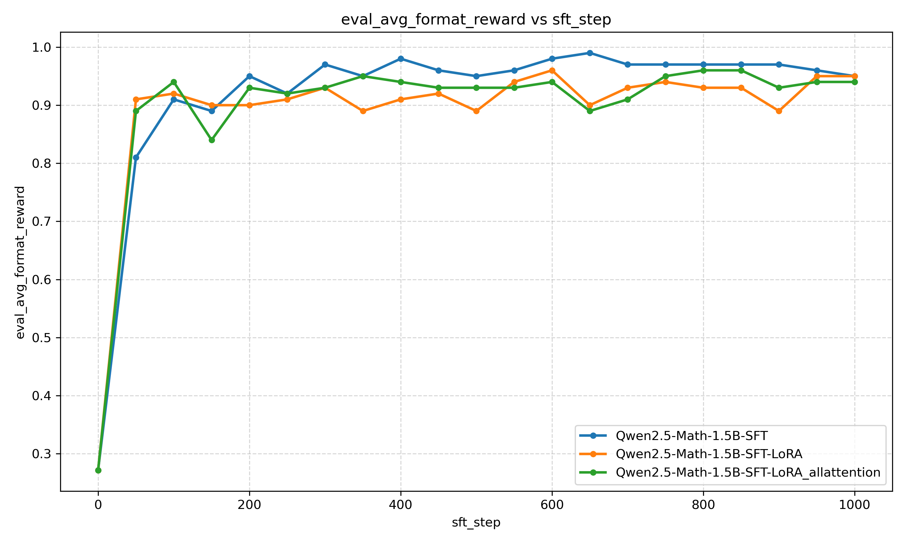
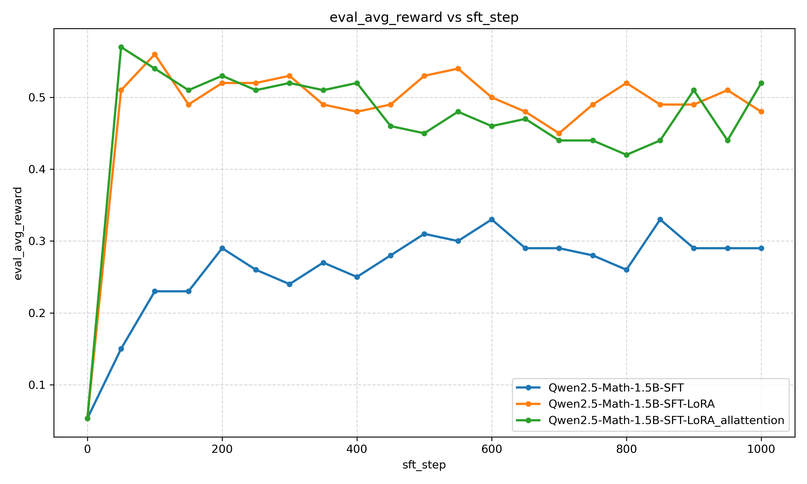
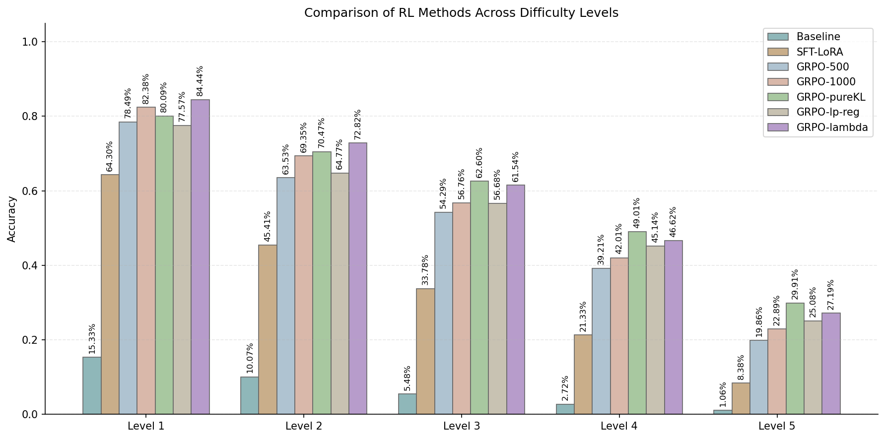
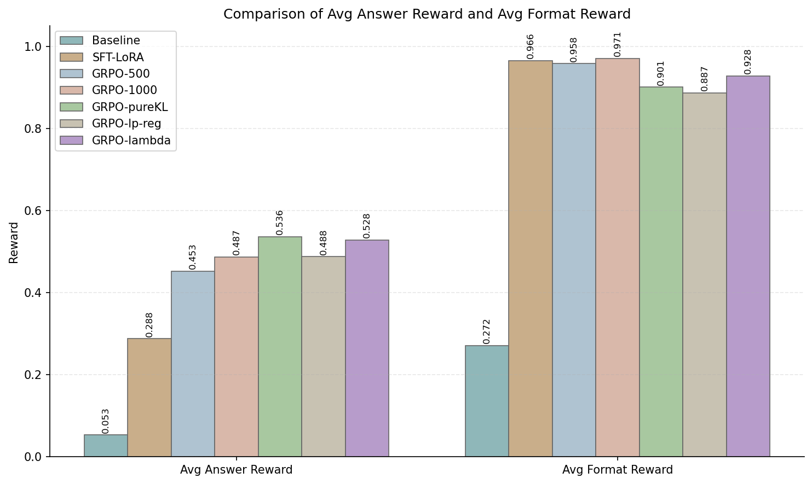

# RLVR for Mathematical Reasoning on Qwen2.5-Math-1.5B: Reproducing and Comparing GRPO Variants

这个项目改编自CS336 Spring 2025 Assignment 5: Alignment。
实验在Qwen2.5-Math-1.5B和一张Nvidia 4090 24G显卡上完成。

## 数据集

我使用了hugging face上的math_lighteval数据集，网址如下：
[https://huggingface.co/datasets/DigitalLearningGmbH/MATH-lighteval](https://huggingface.co/datasets/DigitalLearningGmbH/MATH-lighteval)

数据预处理的代码是`prepare_math_lighteval.py`，位于`baseline_local`目录下。

## 实验结果对比

表内数据为测试集上的平均回答奖励
| Method              | L1     | L2     | L3     | L4     | L5     |
|---------------------|--------|--------|--------|--------|--------|
| Baseline            | 15.33% | 10.07% | 5.48%  | 2.72%  | 1.06%  |
| LoRA                | 64.30% | 45.41% | 33.78% | 21.33% | 8.38%  |
| GRPO-500            | 78.49% | 63.53% | 54.29% | 39.21% | 19.86% |
| GRPO-1000           | 82.38% | 69.35% | 56.76% | 42.01% | 22.89% |
| GRPO-pureKL         | 80.09% | 70.47% | **62.60%** | **49.01%** | **29.91%** |
| GRPO-lp-reg         | 77.57% | 64.77% | 56.68% | 45.14% | 25.08% |
| GRPO-λ              | **84.44%** | **72.82%** | 61.54% | 46.62% | 27.19% |

## 1. Zero-shot baseline测试

使用vllm进行了Zero-shot的baseline测试。需要注意的是，由于模型规模较小，有时模型推理出了答案，但把推理过程也放进了`<answer> </answer>`之间，因此会出现对模型正确回答的误判。这类情况需要重点避免，因此我修改了prompt规则：

```python
def build_prompt(question: str) -> str:
    return (
        "A conversation between User and Assistant. "
        "The User asks a question, and the Assistant solves it.\n"
        "The Assistant must respond in exactly this format:\n"
        "<think> reasoning process </think> <answer> final answer </answer>\n"
        "Do not include any calculations, intermediate steps, or explanations in the <answer> tag."
        "The <answer> tag should only contain the final answer, not the reasoning process.\n"
        f"User: {question}\n"
        "Assistant: <think>" 
    )
```

新的`r1_zero_reward_fn`被记录在`baseline_local/grpo_grader_new.py`文件中。新的`r1_zero_reward_fn`在原本的规则上添加了如下规则：

如果在原本的规则中判断为`answer_reward == 0`，则考虑将response中与latex数学符号无关的字符剔除，再重新与标准答案比对。

经检验，改进后的prompt规则和奖励函数减少了部分模型回答正确但被奖励函数误判的情况。

## 2. SFT

首先需要对训练数据进行转换，原本数据中的`solution`字段，并没有以`</think>`结尾，`gold`字段也并没有被`<answer> </answer>`包裹，所以需要把response设计成`f"{solution}</think><answer>{gold}</answer>"`的格式。详见SFT/python `datatrans.py`。

这部分中，我对比了全参数更新和LoRA微调的区别，经检验LoRA微调不容易出现out of memory的情况，而且在只微调注意力层的情况下，微调效果优于全参数的微调。
微调图片：




注意：

1. 这里的reward效果是抽取测试集100条数据上的测试效果，并不能完全代表全数据集上的效果。
2. `Qwen2.5-Math-1.5B-SFT-LoRA`代表的是对self-attention中的`q_proj`和`o_proj`矩阵进行微调，而`Qwen2.5-Math-1.5B-SFT-LoRA_allattention`代表对self-attention中所有参数进行微调。

## 3. GRPO

(1) **逐渐变化的环境**：由于数据集中自带`level`字段，包含了1到5难度的题，根据学习的一般规律，所以可以考虑在强化学习前期以`Level 1`的题为主，后期逐渐提高高难度题的占比。  
(2) **Cosine的学习率**：强化学习训练过程中，我设置了`lr`和`lf_min`。起初，学习率从`0.1*lr`出发，快速达到`lr`后，以cos函数退火至`lr_min`。  
(3) **累计梯度**：由于只有一张4090显卡，所以训练过程中batch_size过大很容易出现out of memory的情况，所以使用了将batch分成多个microbatch的方法累计`gradient_accumulation_steps`次梯度再更新参数。  
(4) **Dr.GRPO**：由于标准GRPO计算优势时需要除以组内标准差，而这一步可能会过度放大优势，而带来数值不稳定。所以实际实验的是类似Dr.GRPO版本，不过并不完全相同，因为损失中我还是选择了除以response中的tokens数量，这与我不想过度放大梯度的理念对齐。

### 下面列出实验的五种算法以及重要参数配置：

(1) **GRPO-500**：标准的GRPO-clip算法，对应GRPO/GRPO_save_optimizer_every50.py  
配置：`n_grpo_steps = 500`, `rollout_batch_size = 64`, `group_size = 8`, `train_batch_size = 8`, `gradient_accumulation_steps = 8`, `normalize_by_std = False`, `cliprange = 0.2`, `epochs_per_rollout_batch = 4`  

(2) **GRPO-1000**：控制总的训练样本量不变，增多迭代次数，减少每次迭代所需样本量，对应GRPO/GRPO_save_optimizer_every50.py  
配置：`n_grpo_steps = 1000`, `rollout_batch_size = 32`，其他同上  

(3) **GRPO-clip-pureKL**：在GRPO_clip的基础上添加了KL散度作为惩罚项，对应GRPO/GRPO_KL_pureKL.py  
配置：`kl_beta = 0.5`, `old_cache_microbatch_size = 4`，其他同上(2)

(4) **GRPO-lp-reg**：采用了[LP-Reg](https://arxiv.org/abs/2510.03222)的思路，但在原文中clip的上下限被设置成0和10，实验中发现并不适合小模型，所以保留了原本的clip上下限，对应GRPO/GRPO_KL.py  
配置：`lpreg_beta = 0.5`, `lpreg_min_p_ratio = 0.02`, `lpreg_fixed_tau = None`, `lpreg_low_prob_rho = 0.05`，其他同(2)

(5) **GRPO-lambda**：采用了[GRPO-lambda](https://arxiv.org/abs/2510.00194)的思路，使用了文章提出的epsilon_trace方法。对应GRPO/GRPO_lambda_epsilon_trace_no_adv_clip.py  
配置：`kl_beta = 0.04`, `trace_lambda = 0.99`, `gamma = 1.0`, `trace_style = "recent"`，其他同(2)

### 下图是五种方法的对比结果：




## 4. 结论

(1) 在控制总的训练样本量不变的情况下，增多迭代次数，减少每次迭代所需样本量，可以让强化学习的表现更好，因为每一次迭代，都有π_old限制模型的变化，更多次的模型迭代可以尽可能减少clip带来的限制。因此后三种方法都选择了增加迭代次数的方法。  
(2) 关于Reasoning Spark：在[这篇文章](https://arxiv.org/abs/2510.03222)中，研究人员认为，调整KL散度(lp-reg)可以帮助模型保留reasoning spark。具体而言，当token对应的条件概率为“低概率”且大于“噪声概率”时，被认为是reasoning spark，在优势值为负时，利用KL散度(lp-reg)来保护这些关键的token。但在实验中，我发现原文章对于reasoning spark的定义不适用于小模型，所以出现了GRPO-pureKL效果优于GRPO-lp-reg的情况。尽管如此，使用GRPO-lp-reg在level 4和level 5的题上效果都优于GRPO-1000。所以lp-reg确实能起到保护探索性token的作用。
(3) 关于GRPO-lambda：这种方法在level 1和level 2的题上表现最优。标准的GRPO中，使用NAE近似A_{i,t}，但在GRPO-lambda中，NAE的作用是近似δ_t，这种方法使得稀疏的奖励有可能把response的对错归因到token级别。
